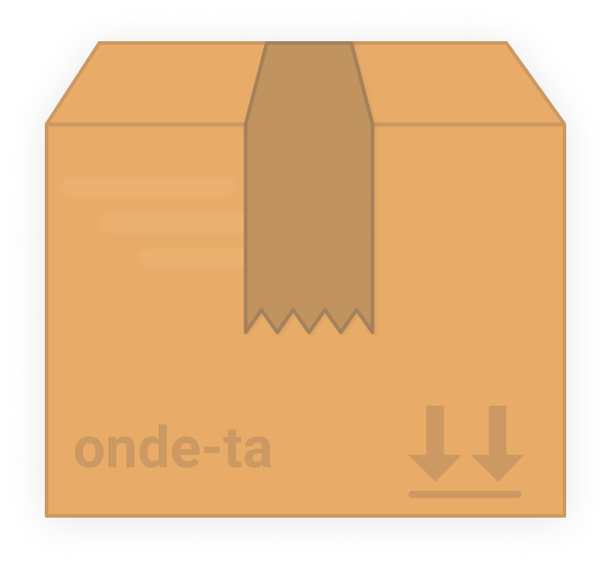

<h1 align="center">
  
</h1>

> Rastreie suas encomendas


<p align="center">
  
</p>

## Install
```
$ npm install --global onde-ta
```

## Usage
```
$ onde-ta --help

  Como usar:
    $ onde-ta RE108441783BR

    Salvar e visualizar códigos de rastreio
    $ onde-ta RE108441783BR --save batman
    $ onde-ta batman

    Remover um código salvo
    $ onde-ta --remove batman
    $ onde-ta --clear

    Listar todos os códigos salvos
    $ onde-ta --list

  Opções
    -s, --save     Salva um código de rastreio com nome
    -r, --remove   Remove o código selecionado
    -c, --clear    Remove todos os códigos salvos
    -l, --list     Listar todos os códigos salvos com um nome
```

## Todo
- [x] Add local storage to save codes by keywords

## License
[MIT](LICENSE.md) © Filipe Linhares
