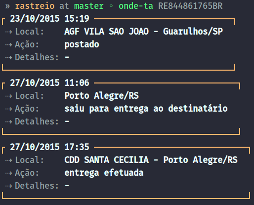

# Onde ta? 
> Rastreie suas encomendas.

<p align="center">
	
</p>

## Install
```
$ npm install --global onde-ta
```

## Usage
```
$ onde-ta --help

  Usage
    $ onde-ta RE108441783BR

    Salvar encomendas e visualizar encomenda salva
    $ onde-ta RE108441783BR --save batman
    $ onde-ta batman

    Remover encomendas
    $ onde-ta --remove batman
    $ onde-ta --clear

    Listar encomendas
    $ onde-ta --save

  Options
    --save     Salva o código de uma encomenda com um nome
    --remove   Remove a encomenda selecionada
    --clear    Remove todas as encomendas salvas
    --list     Lista todas as suas encomendas salvas com --save
```

## Todo
- [x] Add local storage to save codes by keywords

## License
[MIT](LICENSE.md) © Filipe LInhares
